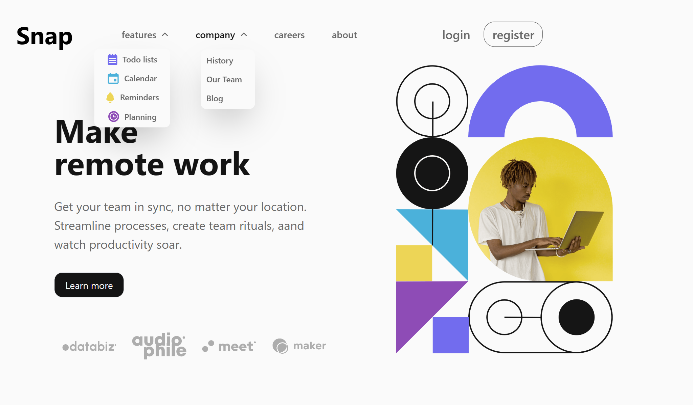

# Frontend Mentor - Intro section with dropdown navigation solution

## Table of contents

- [Overview](#overview)
  - [The challenge](#the-challenge)
  - [Screenshot](#screenshot)
  - [Links](#links)
- [My process](#my-process)
  - [Built with](#built-with)
  - [What I learned](#what-i-learned)
- [Author](#author)

## Overview

### The challenge

Users should be able to:

- View the relevant dropdown menus on desktop and mobile when interacting with the navigation links
- View the optimal layout for the content depending on their device's screen size
- See hover states for all interactive elements on the page

### Screenshot

### Links

- Live Site URL: [Demo here](https://intro-dropdown-nav-sigma.vercel.app/)

## My process

### Built with

- Semantic HTML5 markup
- CSS custom properties
- Flexbox
- Mobile-first (TailwindCSS)
- Vanilla JavaScript

### What I learned

I leant quite alot on handling hamburger menu using the click event, classlist(toggle, add, remove)

## Author

- Frontend Mentor - [@abteck](https://www.frontendmentor.io/profile/abteck)
- Twitter - [@abteck2](https://www.twitter.com/abteck2)
